# Beatrice the Traffic System

A simple simulation in compose-desktop hosting a traffic light controller based on an automata.
Class project for "Języki Formalne i Złożoność Obliczeniowa" labs, UAM 2021SZ.
Named in analogy to Matilda, a traffic managing AI from a webcomic Romantically Apocalyptic.

## Briefing

<!-- ADD PROBLEM DESCRIPTION -->

## Development History & Project Structure Overview

### First Sketches & the Design

Made during the class; laying out main ideas of the project.

 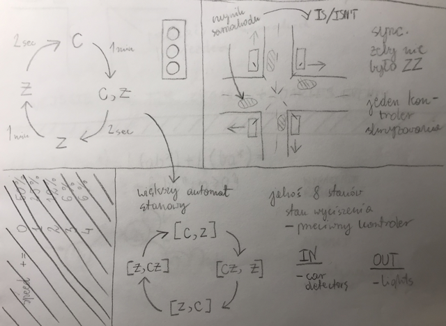

 

 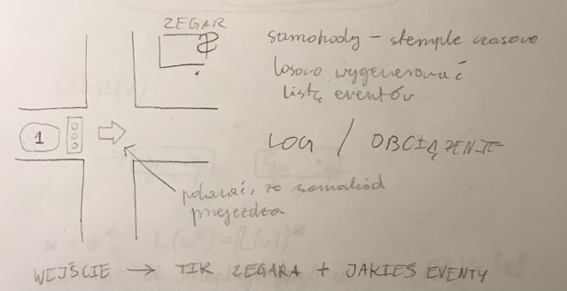

 

Mock-ups made in Numbers; mostly unchanged in translation from sketch to image.

 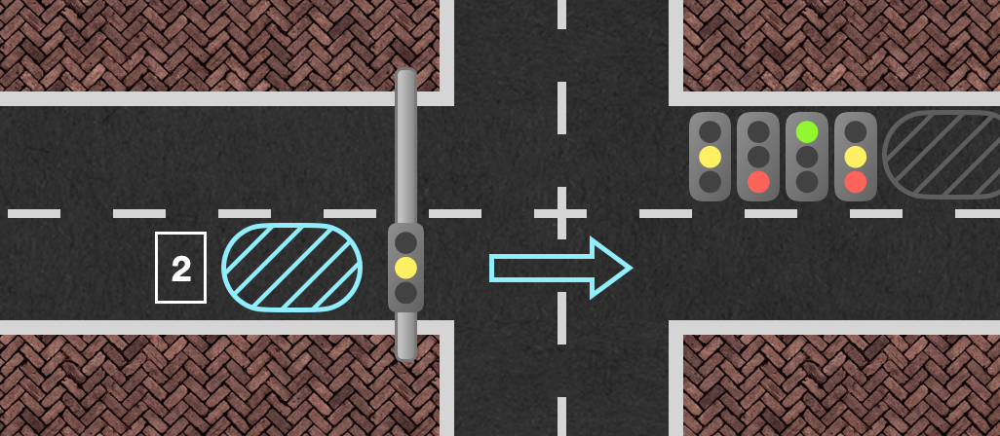

 

 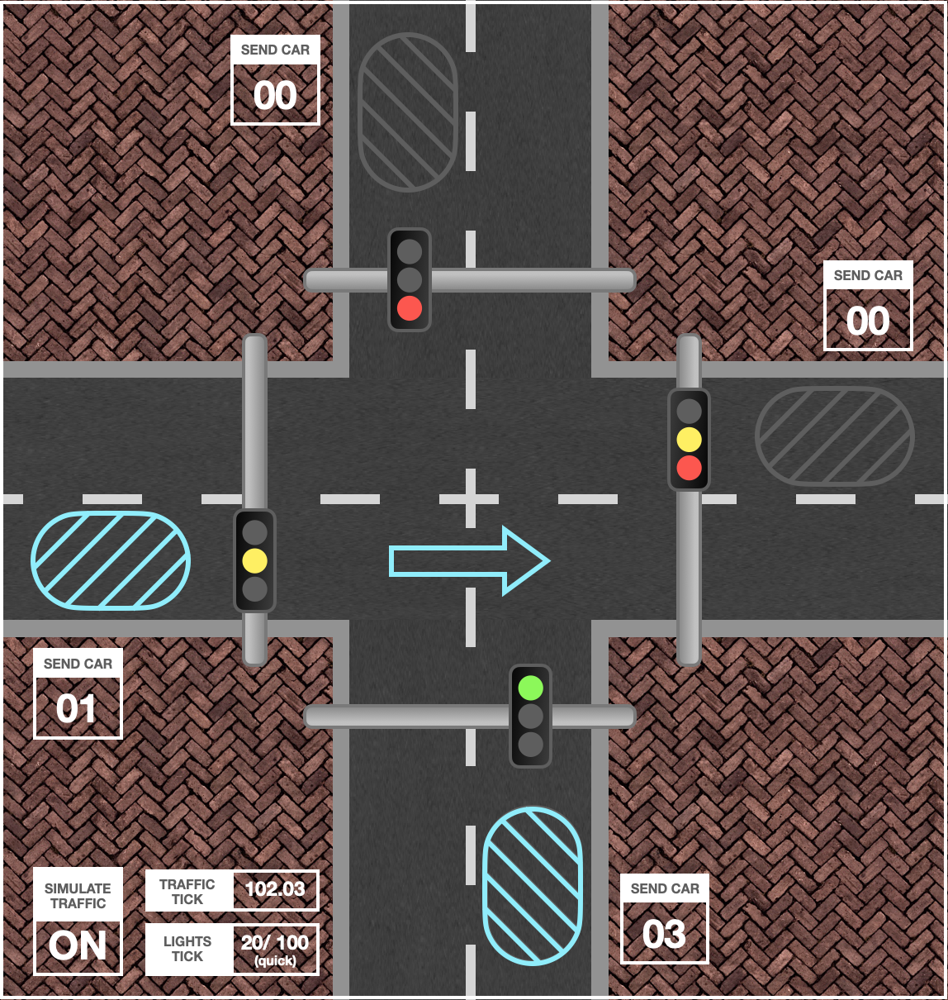

 

### Implementing Graphics and Data

First thing after the main window that I created, was the
GraphicController.
Intended to store sprite states,
(I call all images in this project sprites)
became the backbone of this program.
Since it already stores all the data, later on I just added ticked threads that modify it.

Making the sprites took, as it usually does in my projects, most of development time.
The designs were simple and clear, but getting the exactly right shades, border thicknesses, and image resolution took time.
Also, needed to work with pngs for transparency, installed a new program for that even.

Here's a picture of all sprites placed in their proper positions:

 

 

The system is divided into sections, named after cardinal directions.
Each section includes a light, a car plate, and an arrow.
The arrows are ment to symbolize cars passing through the intersection.

Then I moved onto the gui components.
Implemented my first ever slider, so I did.
Wanted to keep them simple, since the background was already quite busy and sprites will be constantly changing.
Added a splash of color to queue numbers and slider values for
an extra spark tho.

And here's a picture with all the components:

 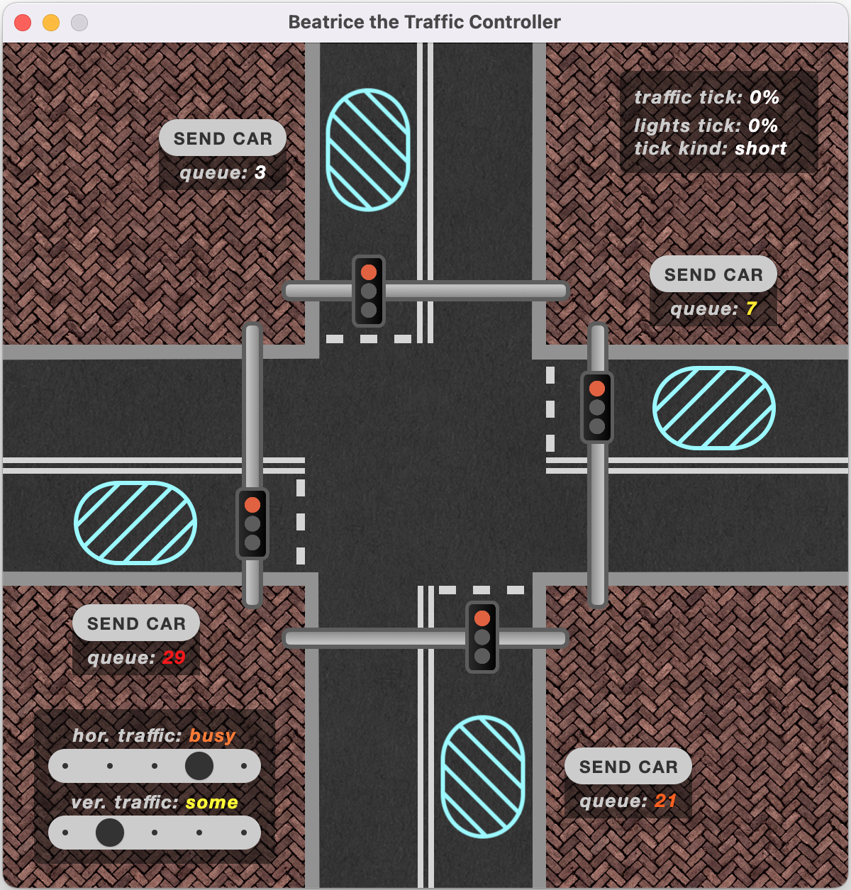

 

Each section has now also a car queue.

Wanting to make sure, that graphics are properly connected to variables, I added a randomly switching function, which just makes it look as if the system was malfunctioning.

 <image width="70%" src="screenshots/broken_1080.gif"/> 

### Implementing the Logic

Most of what the simultion does was quite self-explanatory and straigh foreward, so by the time graphics were implemented I had a class that stores all the data and some enums implemented.
Progress was easy and quick.

Started with adding a main thread, which will calls out three ticked subthreads (with adjustable tick™), which in turn call out their inner functions.

First implemented was the car generation. It's a simple random function based on a traffic flow variable. There are two traffic flow variables the horizontal and the vertical, with their values dependant on sliders.

 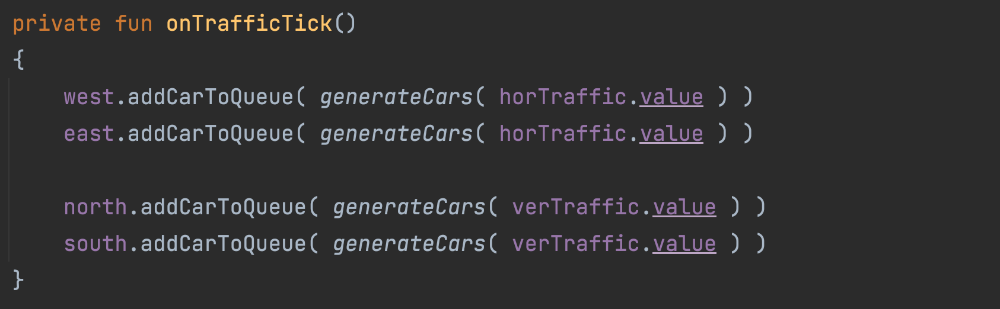

 

 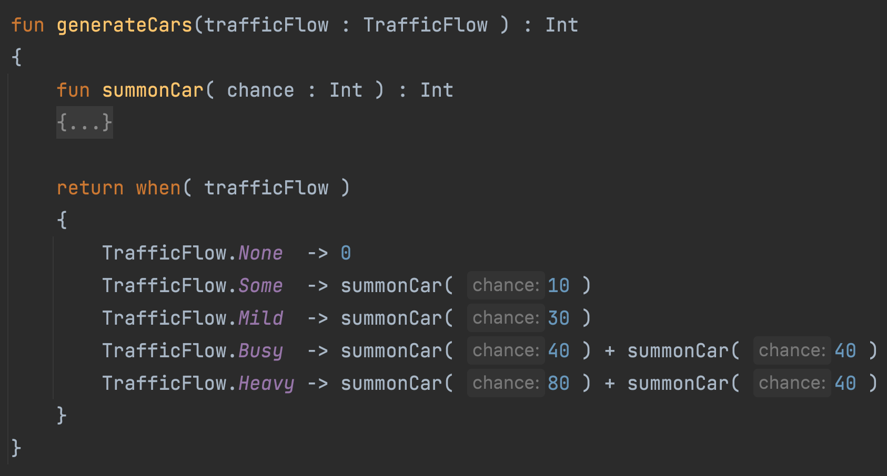

 

 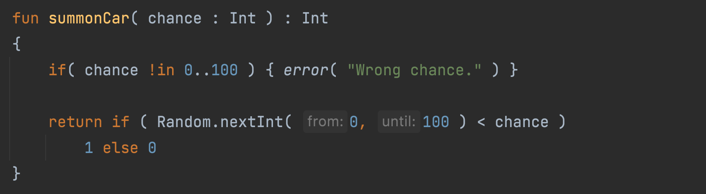

 

Then I moved onto making cars actually leave the system.
Again, just a simple function, checking if a car can drive off.

 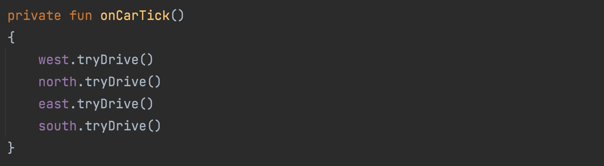

 

 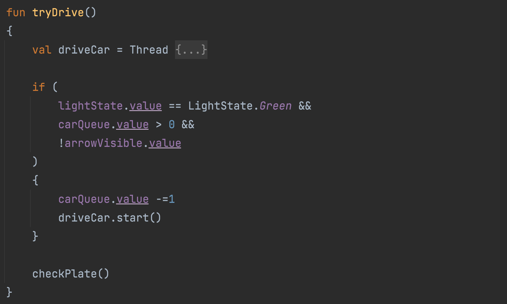

 

 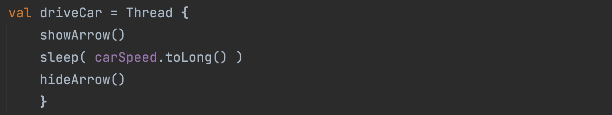

 

Lastlty I moved onto the automata itself. Started with some sketches (in no particular notation):

 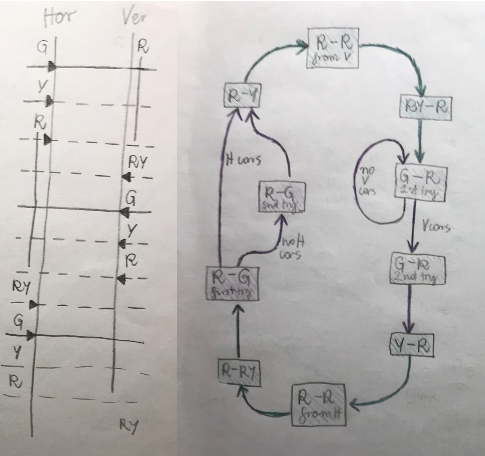

 

Ended up with a diagram:

 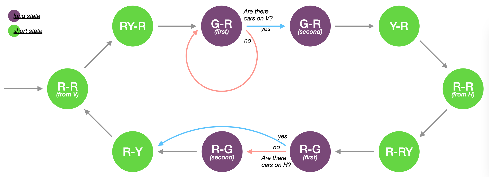

 

<!-- HERE ABOUT TICK KINDS -->

And implemented it:

 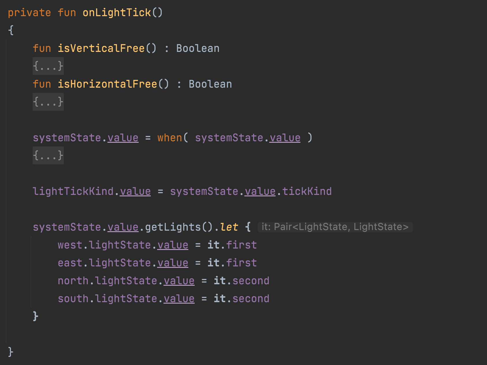

 

 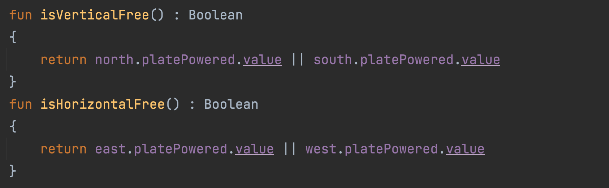

 

 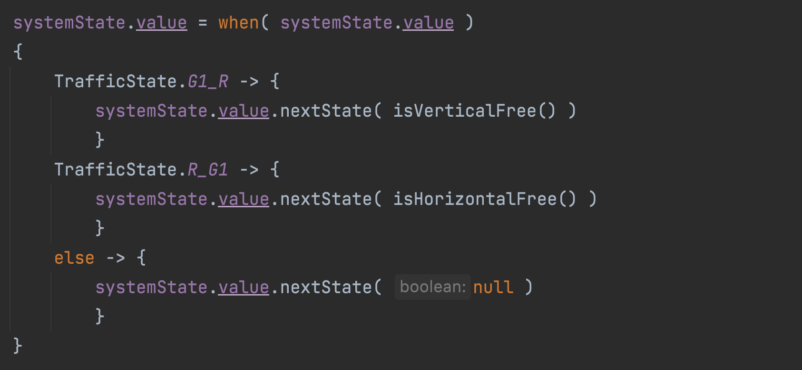

 

 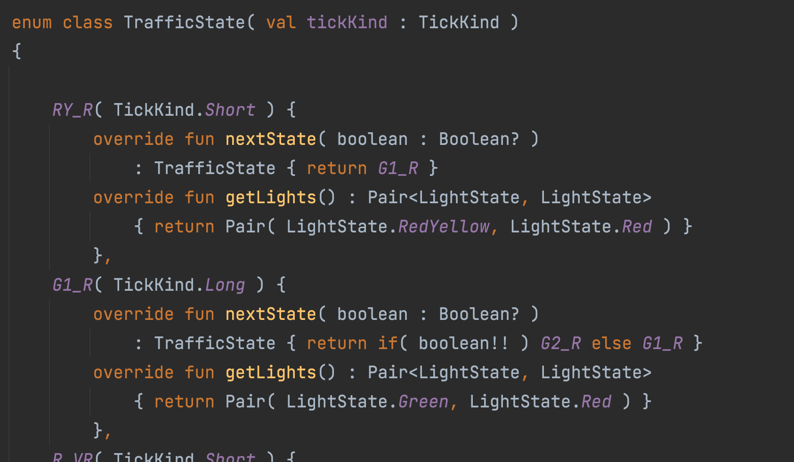

 

And voilà! The simulation was finished. Here are some examples:

<!-- ADD EXAMPLES -->

## Statistics

Source code is 767 lines long, with:
- 235 being the main structure,
- 438 the UI, and
- 94 for logic and algorithms.
