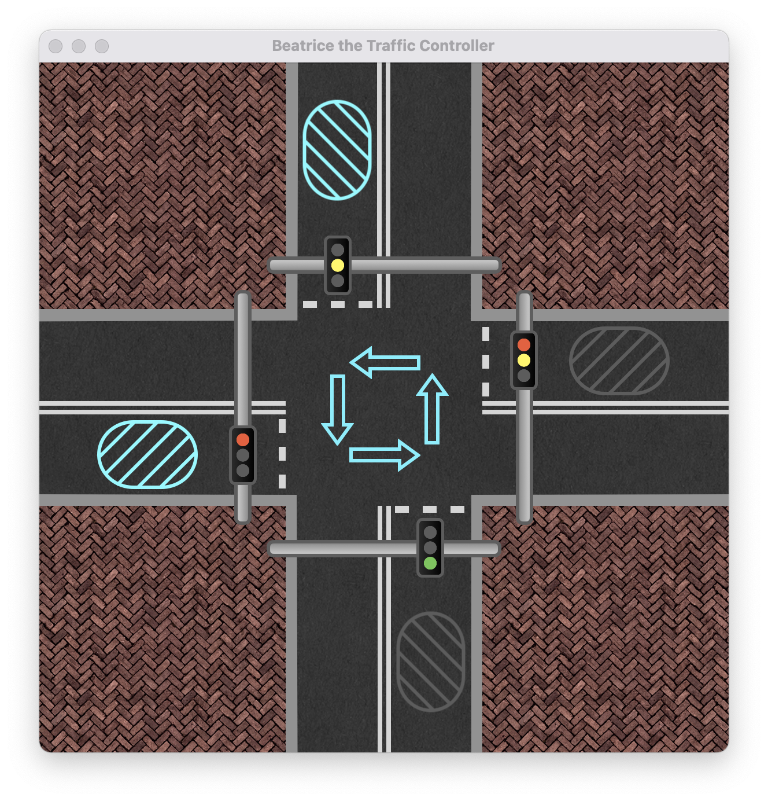

# Beatrice the Traffic System

A simple simulation in compose-desktop hosting a traffic light controller based on an automata.
Class project for "Języki Formalne i Złożoność Obliczeniowa" labs, UAM 2021SZ.
Named in analogy to Matilda, a traffic managing AI from a webcomic Romantically Apocalyptic.

## Development History

### First Sketches

### Design

### Implementing Graphics

    

### Implementing the automata
